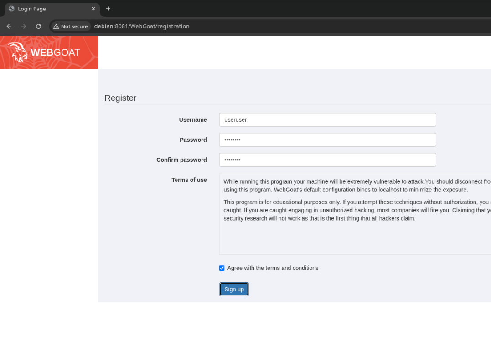
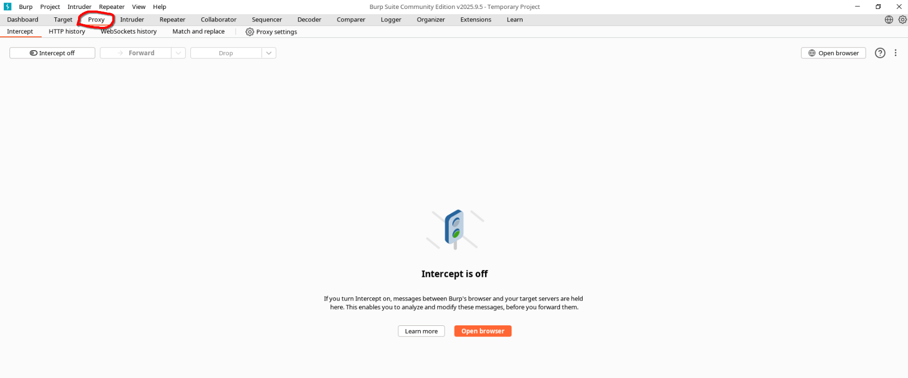
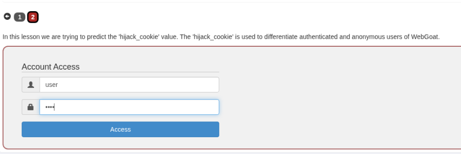
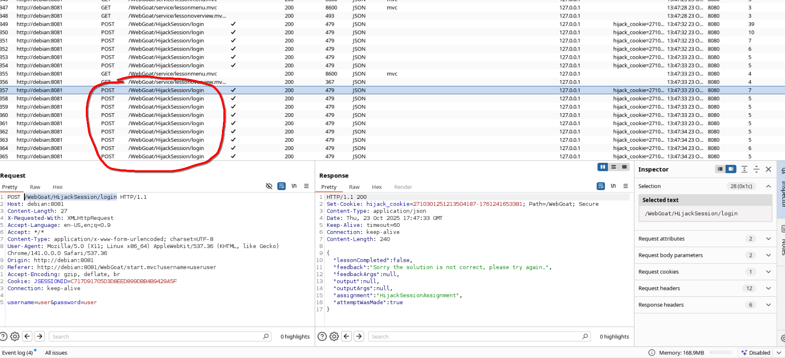
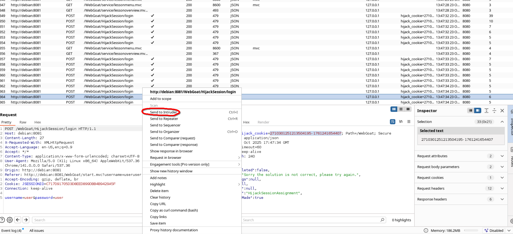
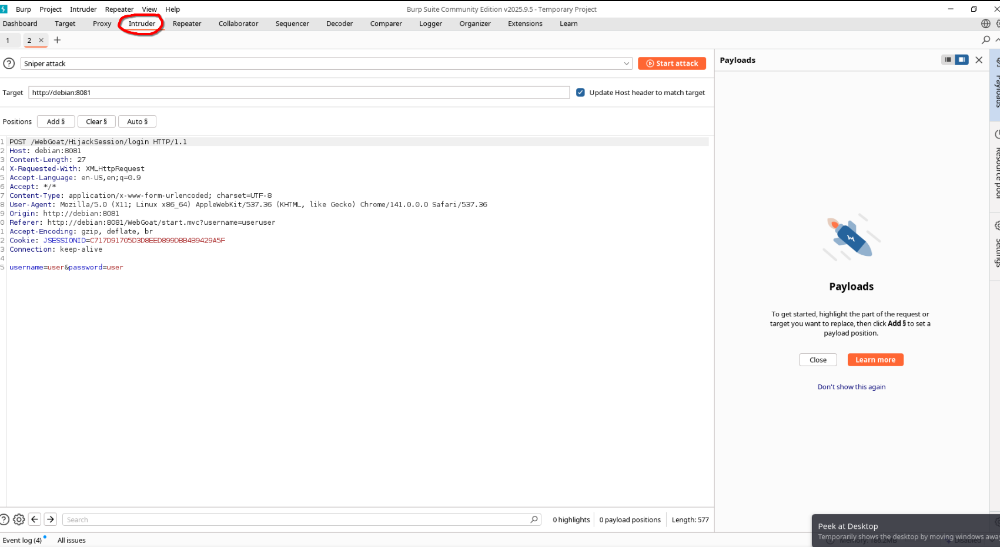
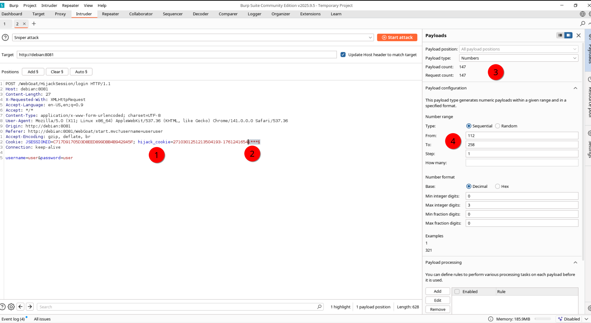
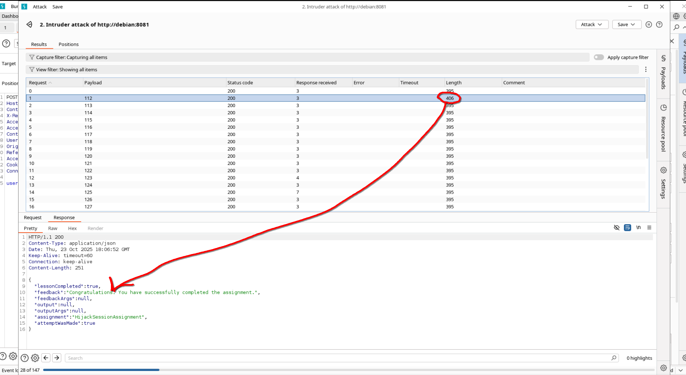

# Установка WebGoat

WebGoat - уязвимое веб-приложения для отработки уязвимостей из OWASP Top Ten. Данный классификатор слабостей веб-систем показывает какие из них наиболее часто встречаются и являются наиболее опасными.

Для запуска данного приложения необходимо предварительно настроить операционную систему.

1. Установка пакетов `docker.io docker-compose-v2`

```sh
sudo apt update
sudo apt install docker-compose-v2 docker.io
```

2. Запуск докер-контейнера с `WebGoat`

```sh
sudo docker run -it -p 8081:8080 -p 127.0.0.1:9090:9090 -e TZ=Europe/Moscow webgoat/webgoat
```

3. Установка Burpsuite

```sh
wget 'https://portswigger.net/burp/releases/download?product=community&version=2025.9.5&type=Linux' -O burpsuite.sh
chmod +x burpsuite.sh
./burpsuite.sh -q
```

# Первые Уязвимости

После того, как контейнер с уязвимым сайтом поднялся необходимо проверить, как он работает, для этого

1. Необходимо зайти на сайт по адресу http://debian:8081/WebGoat.
2. Зарегистрироваться на сайте с произвольными учётными данными.

3. Пройти в первый урок "Broken Access Control", прочитать описание данного недостатка.

## Hijack a session

Поскольку HTTP-соединение использует множество различных TCP-соединений, веб-серверу необходим метод распознавания каждого пользовательского соединения. Наиболее эффективный метод основан на использовании токена, который веб-сервер отправляет браузеру клиента после успешной аутентификации клиента. Токен сеанса обычно представляет собой строку переменной длины и может использоваться различными способами, например, в URL-адресе, в заголовке HTTP-запроса (например, в cookie-файле), в других частях заголовка HTTP-запроса или даже в теле HTTP-запроса.
Атака «Cookie Hijacking» компрометирует токен сеанса, похищая или предсказывая действительный токен сеанса для получения несанкционированного доступа к веб-серверу.

Токен сеанса может быть скомпрометирован различными способами; наиболее распространённые из них:

- Предсказуемый токен сеанса;
- Перехват сеанса;
- Атаки на стороне клиента (XSS, вредоносные коды JavaScript, трояны и т. д.);

Таким образом в данном уроке пройдет отработка "Cookie Hijacking" на основе предсказуемого токена сеанса.

Для прохождения задания необходимо:

1. Запустить Burpsuite и открыть вкладку Proxy.

2. Нажать на кнопку "Open Browser" и перейти в урок "Hijack a Session", внимательно прочитать задание.
3. Перейти на вторую вкладку задания.
4. Попробовать отправить логин и пароль с помощью формы несколько раз подряд.

5. После чего перейти обратно в Burpsuite и посмотреть какие HTTP-запросы отправились на сервер. Данные запросы будут находиться во вкладке "HTTP history" и иметь URL `/WebGoat/HijackSession/login`. 

6. Если нажать на запрос, снизу можно увидеть тело запроса и тело ответа, которое было возвращено веб-сервером. Можно заметить, что в для установления сессии сервер добавил в ответ заголовок `Set-Cookie: hijack_cookie=2710301251213504187-1761241653381; Path=/WebGoat; Secure`. Этот заголовок даёт команду клиенту на установку сессионого токена. Уязвимость в данном случае заключается в предсказуемости данного токена. ДАвайте это проверим и посмотрим, какие токены шли дальше в запросах.
```
2710301251213504187-1761241653381
2710301251213504188-1761241653532
2710301251213504189-1761241653679
2710301251213504190-1761241653827
2710301251213504191-1761241653959
2710301251213504192-1761241654112
2710301251213504194-1761241654258
2710301251213504195-1761241654407
```

Видно, что значения токенов разделены на две части **2710301251213504194** и **1761241654258**. Первое значение обозначает некий идентификатор, который увеличивается на единицу с каждой новой сессией. В то время как второе значение отвечает за уникальность токена и обозначает временную метку времени в момент создания данного токена. Проверить это можно выполнив команду: `awk '{print strftime("%c", ( 1761241654258 + 500 ) / 1000 )}'`

К тому же видно, что между двуся сессионными токенами есть разрыв
```
2710301251213504192-1761241654112
2710301251213504194-1761241654258
```
не хватает идентификатора **2710301251213504193**, который судя по всему был выдан другому человеку. Теперь для того, чтобы подобрать данный сессионный токен нам нужно подобрать вторую часть данного токена, чтобы воспользоваться чужим сессионным токеном и перехватить аккаунт другого пользователя. Для этого воспользуемся BurpSuite и зададим нужные параметры атаки. Известно, что временная метка атакуемого токена находится в пределах от 1761241654112 до 1761241654258. Следовательно необходимо перебрать всего **146** значений, чтобы получить чужой токен (это очень мало).

```
2710301251213504192-1761241654112
2710301251213504193-1761241654***
2710301251213504194-1761241654258
```

7. В Burpsuite жмём ПКМ по пакету, который отвечает за авторизацию на сервере и выбираем пункт "Send to Intruder"

8. Переходим во вкладку "Intruder" и задаём необходимые параметры атаки

9. Устанавливаем сессионный токен, который будет перебирать (1). Выбираем место где будем перебирать значения (2) с помощью клавиши "Add $". Выбираем тип атаки numbers (3) и выставляем необходимые параметры (4).

10. Запускаем атку с помощью клавиши "Start Attack" и ждём, пока ответ на один из наших запросов не будет **необычным**. Под необычным можно понимать ответ, который имеет другую длину пакета или другой код ответа.


11. Таким образом мы успешно нашли сессионный токен другого пользователя, воспользовавшись слабостью в механизме токенов. 