# Path Traversal

Атака с обходом пути (также известная как обход каталога) направлена ​​на доступ к файлам и каталогам, хранящимся за пределами корневой папки веб-сайта. Манипулируя переменными, ссылающимися на файлы, с помощью последовательностей «точка-точка-слеш (../)» и их вариаций, или используя абсолютные пути к файлам, можно получить доступ к произвольным файлам и каталогам, хранящимся в файловой системе, включая исходный код или конфигурацию приложений, а также критически важные системные файлы. Следует отметить, что доступ к файлам ограничен системным контролем доступа (например, в случае заблокированных или используемых файлов в операционной системе Microsoft Windows).

Эта атака также известна как “dot-dot-slash”, “directory traversal”, “directory climbing” и “backtracking”.

## База

Для прохождения задания необходимо развернуть WebGoat, как это было показано в предыдущем уроке. А так же запустить Burpsuite для анализа трафика.

1. Переходим к занятию "(A3) Injection" -> "Path Traversal"
2. Внимательно читаем описание недостатка, которое может привести к уязвимости.
3. Переходим во вторую вкладку и начинаем отправлять данные из формы, которая имитирует обновление картинки пользователя. Перед этим предварительно выбираем файл, который будет отправляться вместе с запросом, нажав на иконку профиля.
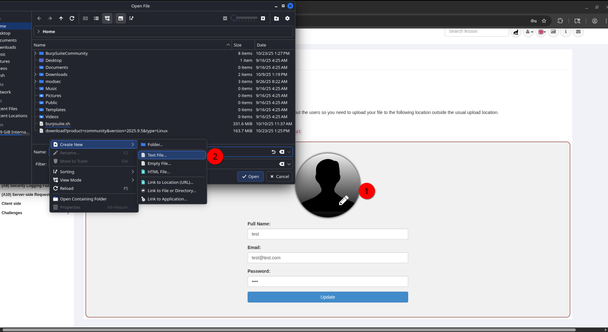
4. Посмотрим какие данные передаются при нажатии на кнопку "Update"
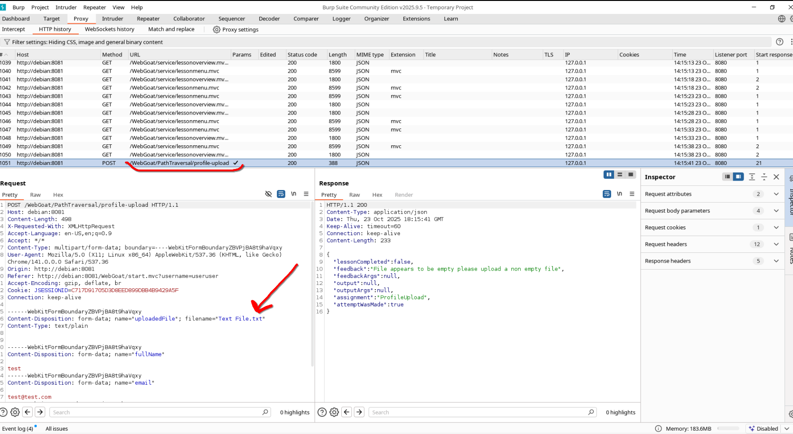
5. При отправке формы передаётся `Content-Type: multipart/form-data; boundary=----WebKitFormBoundaryZBVPjBA8t9haVqxy` Это значит, что информация может передаваться не URL кодированная, с новыми строками и другими символами. При этом все параметры будут разделены специальном маркером `----WebKitFormBoundaryZBVPjBA8t9haVqxy`. Названия передаваемых параметров отражены в поле `name`. При передаче файла также указывается его название в поле `filename`.
6. Нам вернуло ошибку, что мы отправили пустой файл, попробуем это исправить и отправить какие-то данные с помощью Burpsuite. Для этого жмём ПКМ по запросу и выбираем пункт "Send To Repeater".
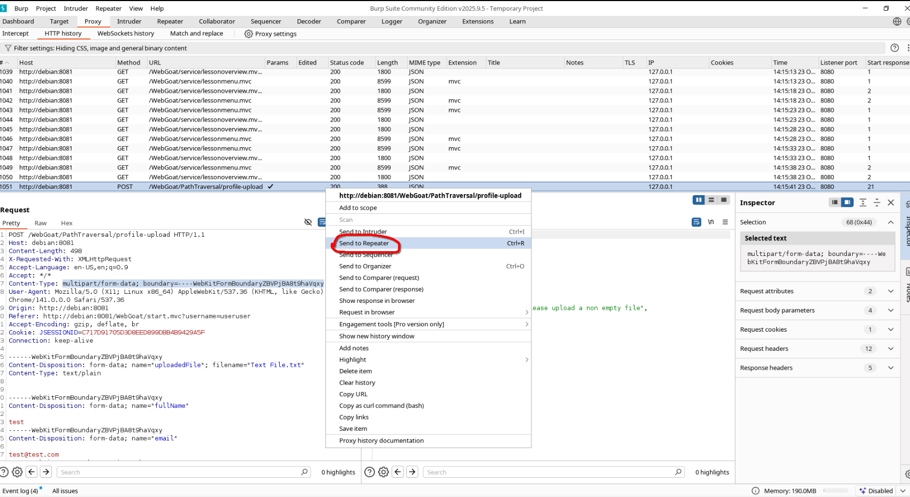
7. После чего переходим во вкладку "Repeater".
8. Во вкладке Repeater добавим немного содержимого в отправляемый запрос и отправим изменённый запрос с помощью кнопки "Send"
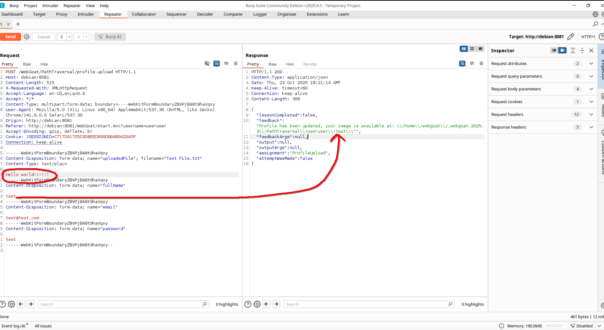
9. На изображении выше видно, что в ответе вернулся путь, куда положилась отправленная фотография, и в данном пути фигурирует имя нашего пользователя. На данный момент файлы кладутся в следующий файл `/home/webgoat/.webgoat-2025.3/PathTraversal/useruser/test`. А по заданию нам необходимо создать файл в директории `/home/webgoat/.webgoat-2025.3/PathTraversal`. Это можно сделать, если в качестве имени передать `../test`, что приведёт исходный путь `/home/webgoat/.webgoat-2025.3/PathTraversal/useruser/test` к следующему виду `/home/webgoat/.webgoat-2025.3/PathTraversal/useruser/../test`.
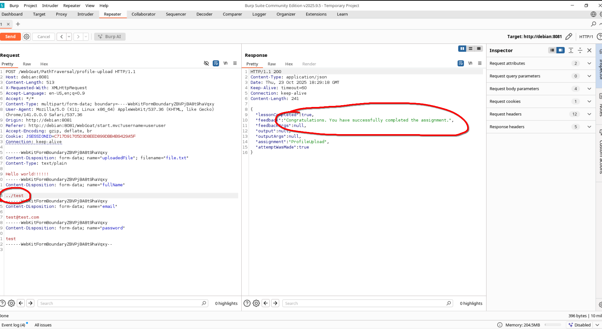

## Обход защиты

При проверке путей некоторые ращработчики могут проверять путь на наличие символов `../` и вырезать их в случае обнаружения, однако данную защиту можно обойти, если отправить, к примеру `..././`, тогда в данном случае программа найдёт подстроку .**../**./, вырежет её и оставит необходимые нам символы **../**. Попробуем данный способ обхода защиты на практике.

1. Отправляем запрос как в прошлый раз и смотрим, что отправляется на сервер.
 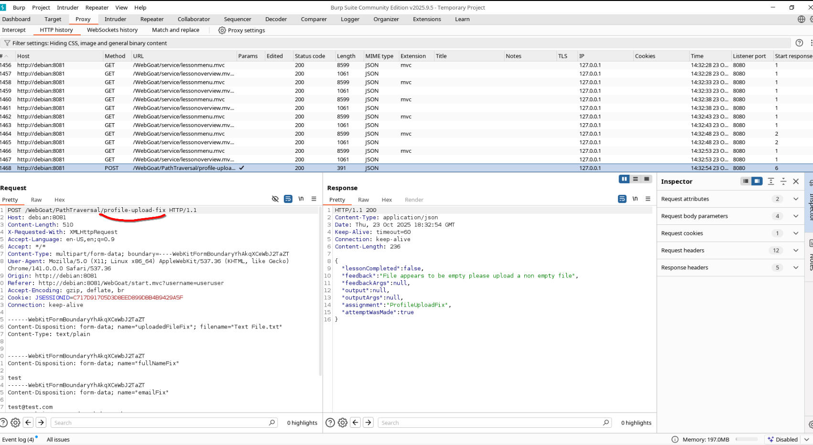
2. Поля уже известные и порядок действий тоже. Поэтому попробуем отправить данный запрос в Repeater и изменить поле fullNameFix на `../test`
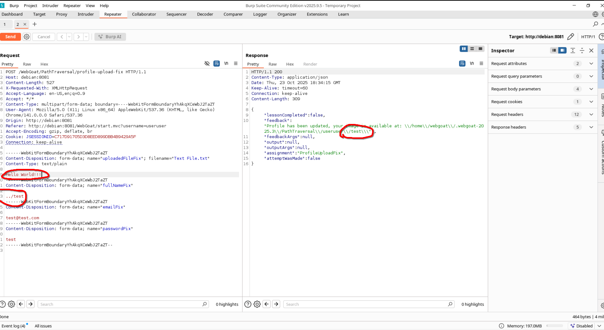
3. Атака не отработала, и наши две точки были вырезаны. Попробуем по предложенному способу отправить `..././`.
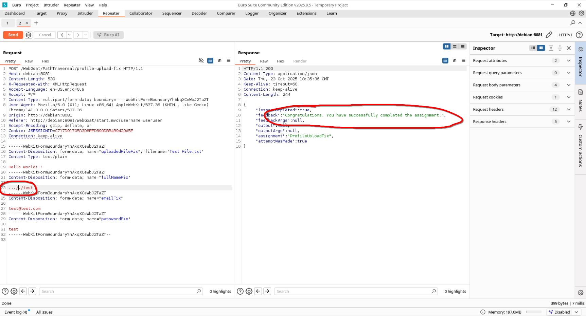
4. Атака отработала, потому что скрипт отработал по приведённому выше алгоритму. На самом деле, данный способ обхода иногда работает и при других видах инъекций, таких как SQL. `selSELECTect` -> `select`.

## Третий этап

1. Третий этап выполните самостоятельно. Принцип точно такой же, однако немного отличается.

## Получение файлов с помощью Path Traversal

Главной уязвимостью при Path Traversal является возможность доступа к другим файлам, к которым доступа быть не должно. Попробуем на примере проэксплуатировать данный недостаток.

1. Несколько раз нажмём на кнопку "Show random cat picture" и посмотрим какие запросы отправляются на веб-сервер
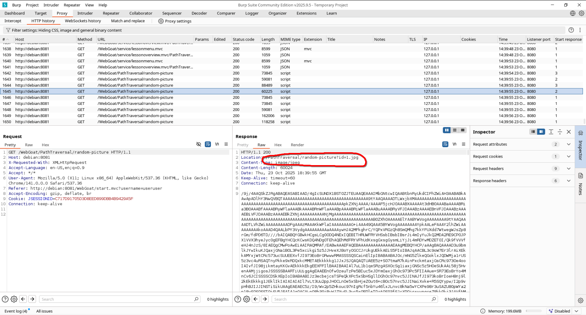
2. Видим, что с помощью заголовка `Location` отправляется путь, откуда был взят файл, попробуем перейти по этому пути. Для этого отправляем наш запрос в Repeater и подредактируем его.
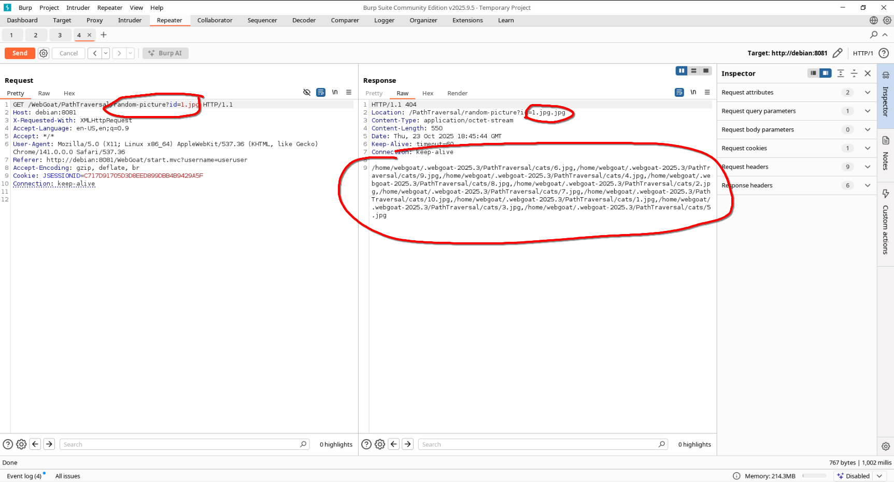
3. Сразу замечаем несколько деталей. Наш путь автоматически дополнился расширением `.jpg`. В случае ошибки, когда сервер не может найти нужный файл он возвращает список файлов в директории. По заданию нам необходимо найти файл `path-traversal-secret.jpg`, однако в данной папке его нет. Воспользуемся недостатком и попробуем выйти из директории, отправив `../`.
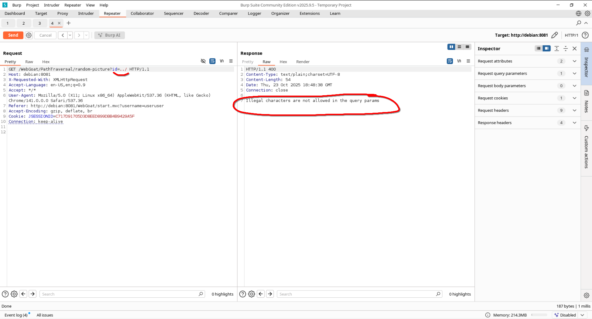
4. Отправить запрос не получилось, по той причине, что параметры, которые передаются через URL должны быть закодированы с помощью метода URL Encoding. Чтобы это сделать можно воспользовться большим количеством инструментов, один из них встроен прямо в BurpSuite И находится во вкладке "Decoder". Для кодирования выполняем следующий порядок действий: вводим полезную нагрузку в поле(1) выбираем тип кодирования URL(2), копируем нагрузку из поля снизу(3)
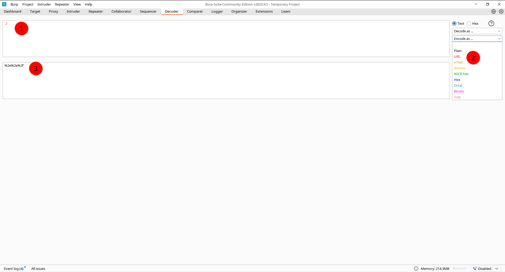
5. Получившуюся нагрузку вставляем в URL и смотрим что получилось.
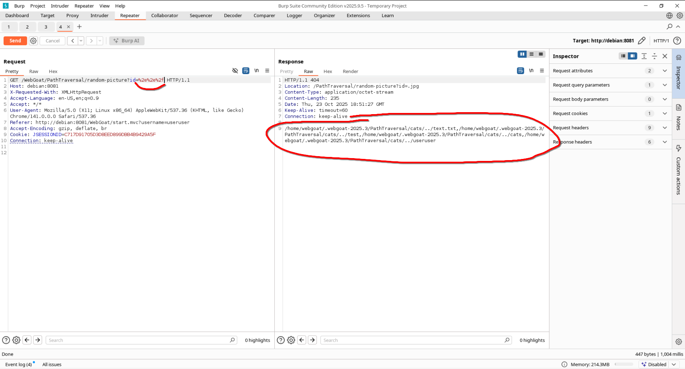
6. Нужного файла снова нет, поэтому попробуем поискать ещё на уровень повыше `../../`
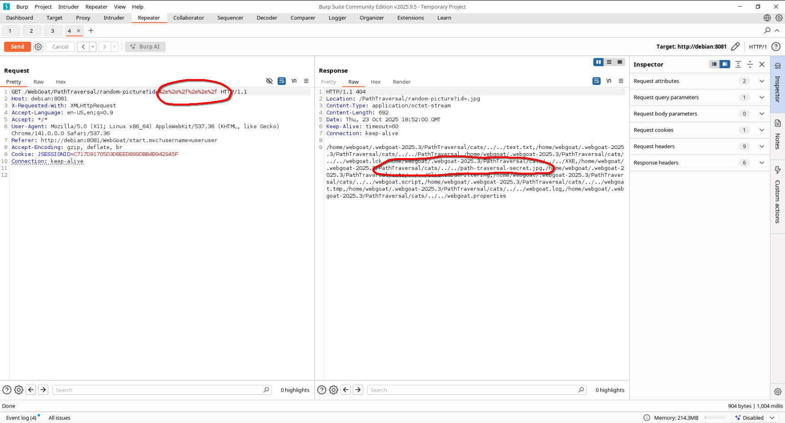
7. Видим, что есть необходимый нам файл и пытаемся получить к нему доступ (держим в голове, что .jpg добавляется автоматически) `../../path-traversal-secret`
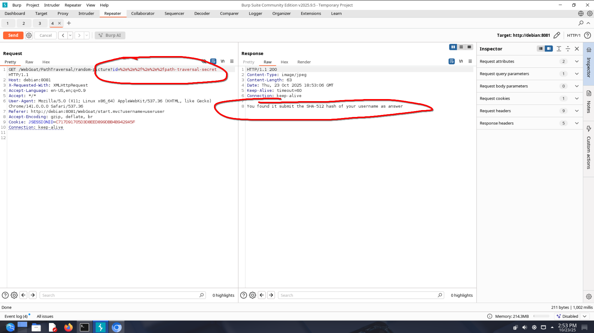
8. В качестве ответа к заданию необходимо рассчитать SHA512 от имени пользователя командой `echo -n "useruser" | sha512sum`

## Последнее задание самостоятельно!!!!!!

