# JWT Tokens

JWT используются для передачи информации, связанной с личностью и характеристиками (претензиями) клиента. Эта информация подписывается сервером, чтобы гарантировать, что она не была подделана после отправки клиенту. Это не позволяет злоумышленнику изменить удостоверение или характеристики — например, изменить роль с простого пользователя на администратора или изменить логин клиента. Токен создается во время аутентификации (он выдается при успешной аутентификации) и проверяется сервером перед любой обработкой. Приложения используют маркер для того, чтобы позволить клиенту предъявить серверу то, что по сути является «удостоверением личности». После этого сервер может безопасно проверить действительность и целостность токена. Этот подход является переносимым без сохранения состояния, что означает, что он работает на различных клиентских и серверных технологиях, а также по различным транспортным каналам, хотя чаще всего используется HTTP.

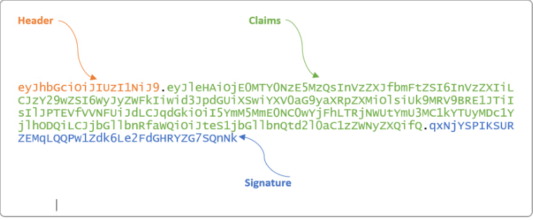

- header — содержит информацию об алгоритме шифрования и типе токена (JWT)
- payload — данные токена. Стандартные поля:
    - iss (Issuer) — издатель токена. Как правило — uuid приложения, выпустившего токен.
    - sub (Subject) — собственник токена. Как правило — uuid пользователя
    - aud (Audience) — массив url серверов, для которых предназначен токен
    - exp (Expiration Time) — время, в течение которого токен считается валидным.
    - nbf (Not Before) — временная метка, до которой токен не считается валидным
    - iat (Issued At) — время создания токена
    - jti (JWT ID) — уникальный идентификатор токена
- signature — строка, полученная из частей токена (header + payload) при помощи шифрования

# Уязвимости применения

- None алгоритм
- Кража токена
- Отсутствие механизма контроля время жизни токена
- Раскрытие информации из токена
- Слабый секрет токена

Рассмотрим некоторые из этих атак

# База

1. Первым делом необходимо разобраться со структурой токена. Токен состоит из трех частей, описание которых было приведено выше. JWT токен может быть спокойно прочитан любой стороной, которая им обладает. Вся суть заключается в том, что изменить токен можно только с криптографический подписью, которая проверяется на стороне сервера. Но это не мешает нам получить некоторую информацию из токена, которую затем можно будет применять при других атаках.
2. Заходим на сайт https://jwt.io либо на https://cyberchef.org и пользуемся встроенным инструментом, чтобы декодировать токен из задания и получить имя пользователя.

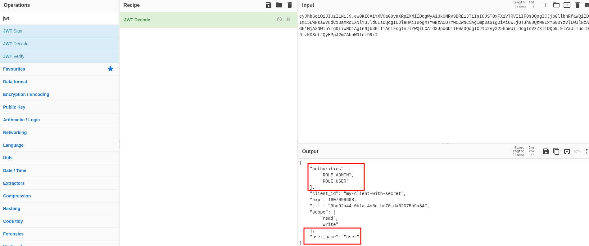
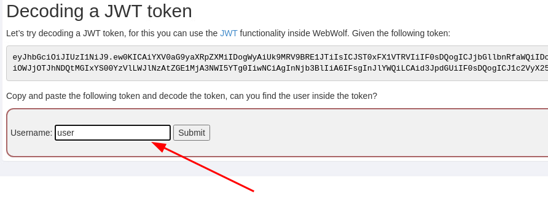

3. В следующем задании проверяется, что будет происходить, если не проверять корректность подписи JWT токена. Отправим запрос на голосование от пользователя `Tom`

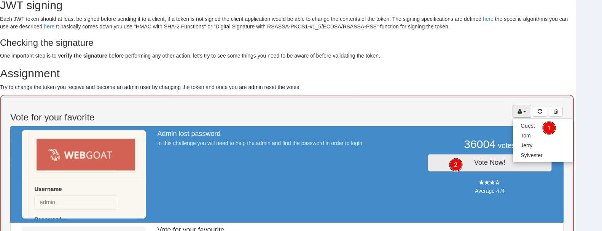
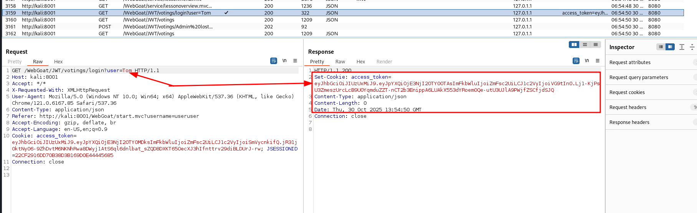

4. Видим, что отправляется JWT Token. Попробуем его декодировать.

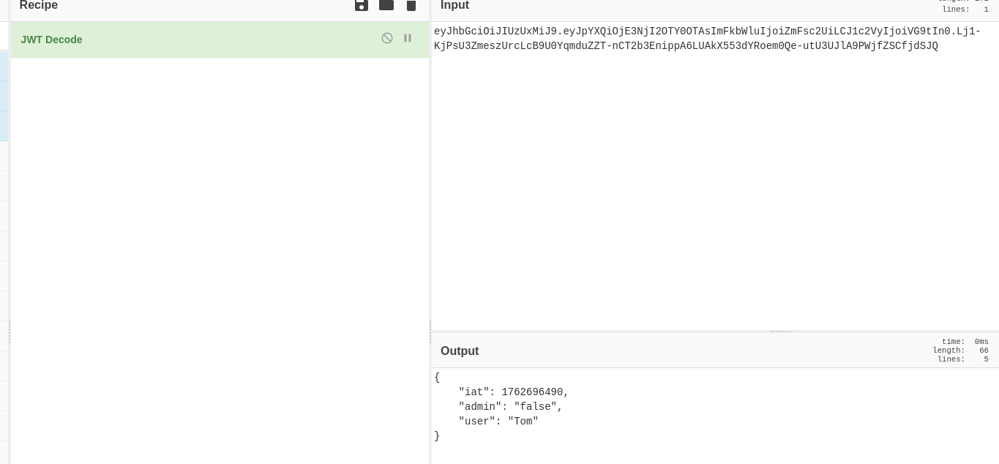

5. Видим, что права администратора объявляются в структуре JSON. Изменим права пользователя с `admin: "false"` на `admin: "true"`. Поставим при этом тип подписи `None`, чтобы сервер не проверял ее корректность.

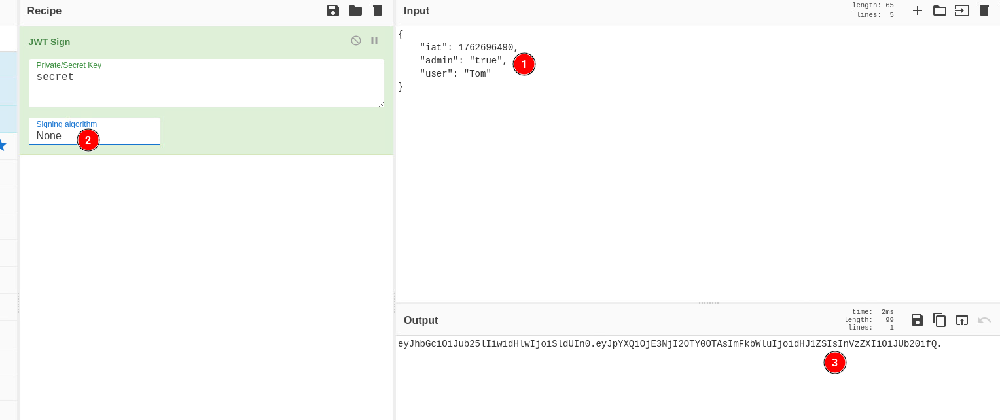

6. Отправим с новым JWT токеном запрос на сброс голосов

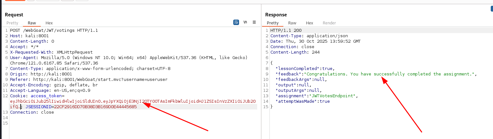
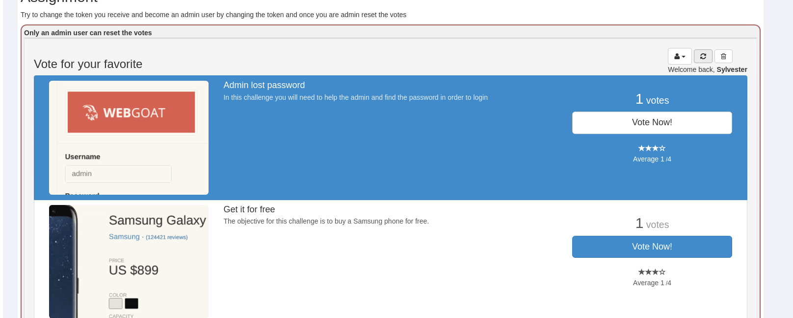

7. Проанализируйте код из восьмого задания и правильно ответьте на вопросы.
8. Если использовать слабы или стандартные парольные фразы для подписи JWT токена, то можно оказаться под угрозой взлома. Попробуем самостоятельно перебрать секрет JWT токена с помощью утилиты John.

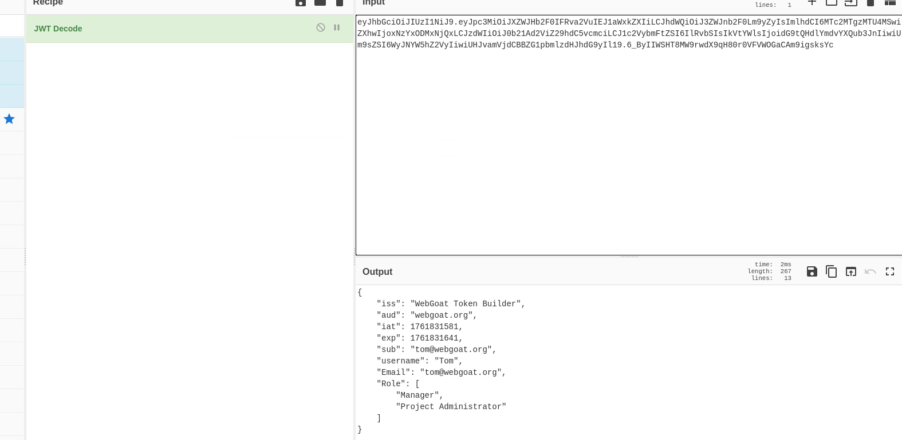

9. Помещаем токен в файл `hash` и запускаем перебор пароля по словарю
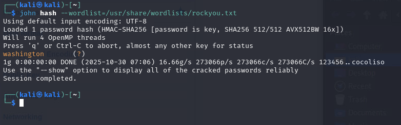

10. Находим пароль `washington` и формируем новую нагрузку с пользователем `WebGoat`

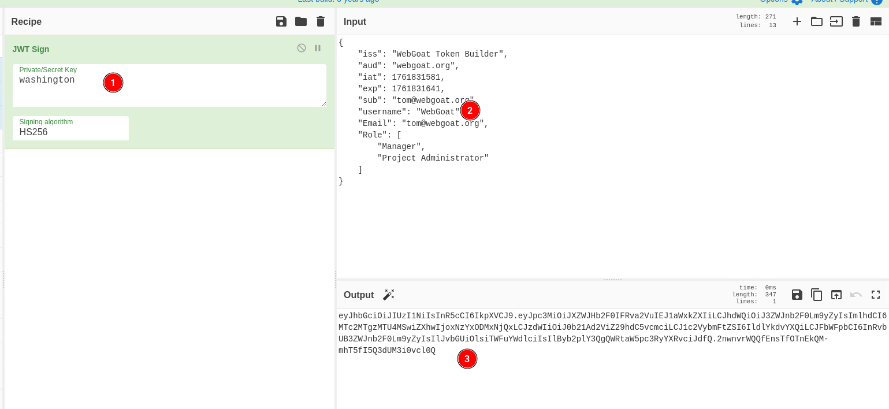
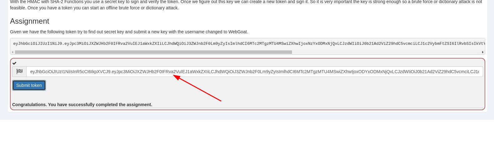

11. Задание 13 на самостоятельно выполнение!!!
12. 16-18 на своё усмотрение